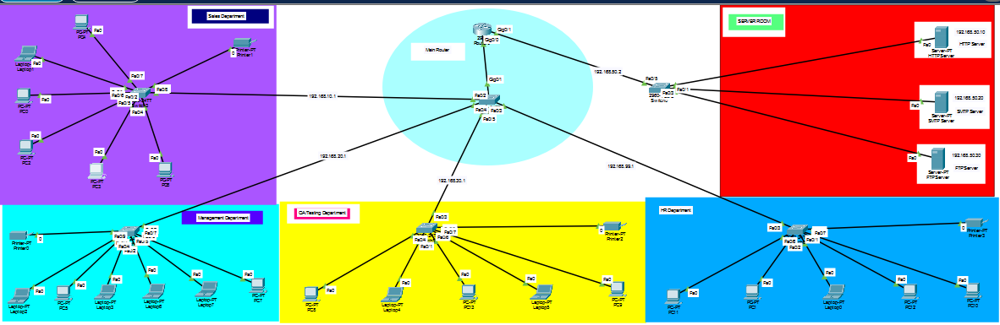
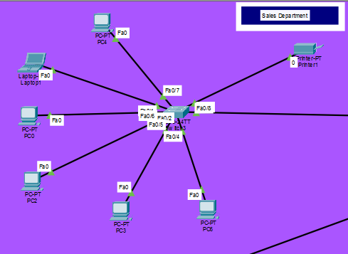
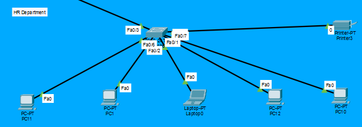
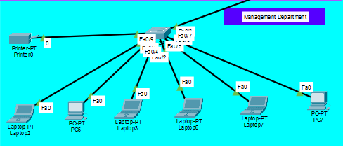
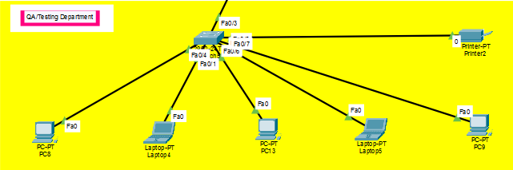
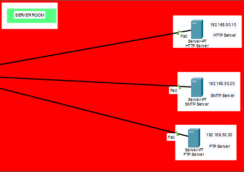
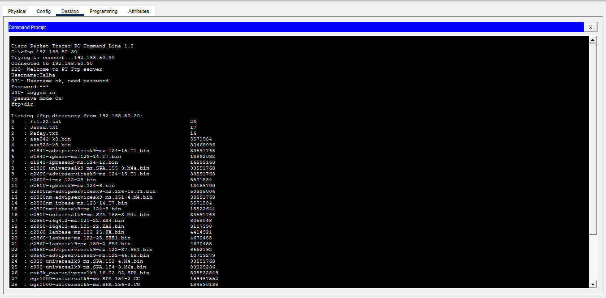
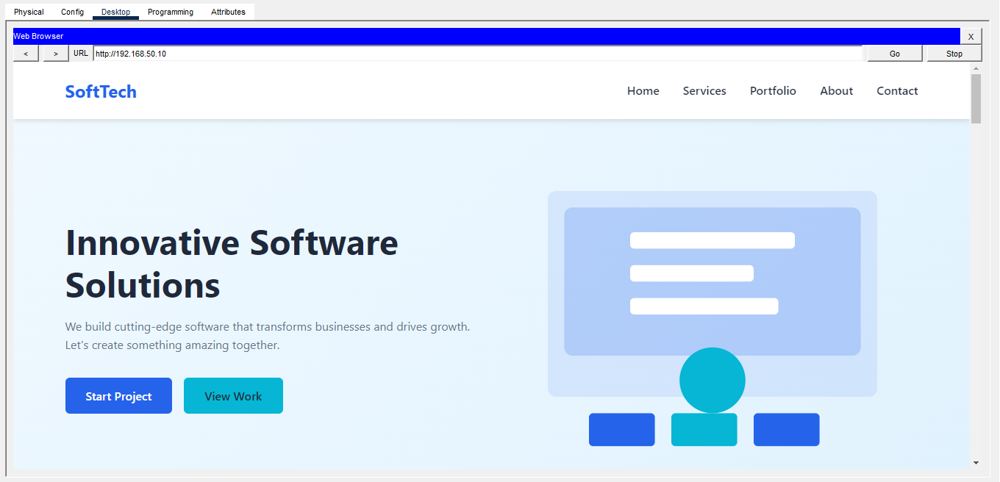

# Cisco-Network-Project
**Software Company Network 🏥**

**We Includes Different Departments:**

- Sales Dept
- HR Dept
- Management Dept
- Testing Dept

**We Also Includes different Servers:**
- HTTP ( For managing data smooth data handling from server to client )
- SMTP ( For managing all types of emails/mails )
- FTP ( For managing all files uploadion, deletion, etc )

**Screen Shots**

### 1) Whole System

### 2) Sales Dept

### 3) HR Dept

### 4) Manage

### 5) Testing

### 6) Servers

### 7) Files FTP

### 8) Email SMTP

### 9) Web_Portal HTTP

